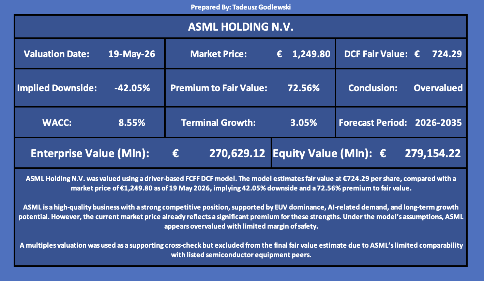
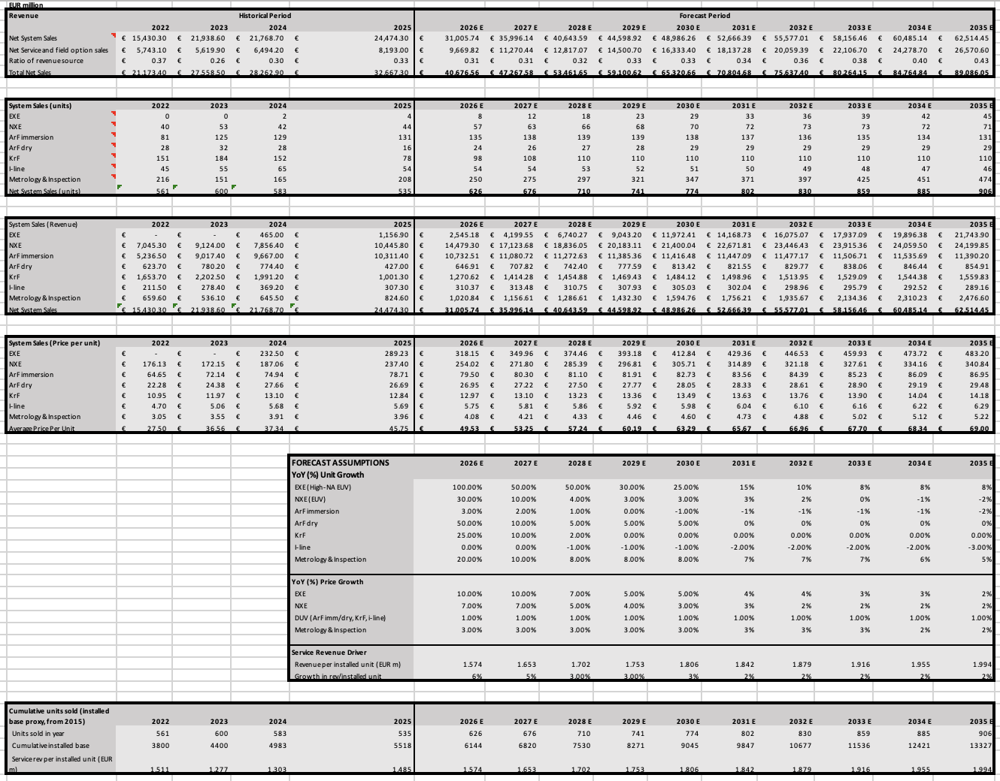
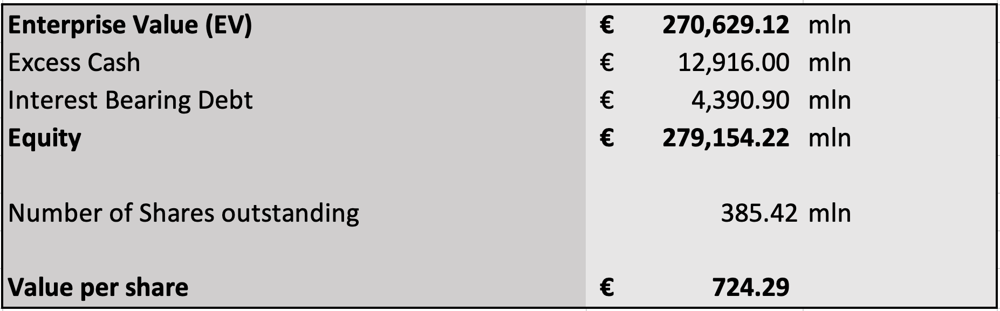
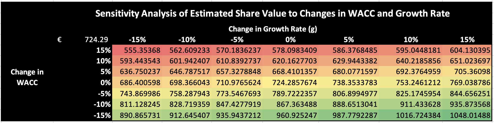
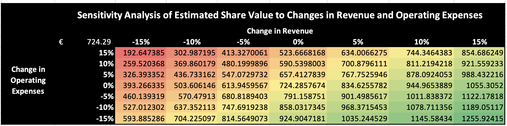

# ASML Valuation

FCFF DCF valuation of **ASML Holding N.V.** using a driver-based revenue model, WACC construction and sensitivity analysis.

**Valuation date:** 19 May 2026

## Project Overview

This project presents a full valuation of ASML Holding N.V., a leading semiconductor equipment company and the sole global supplier of EUV lithography systems.

The valuation is based primarily on a **Free Cash Flow to the Firm (FCFF) Discounted Cash Flow (DCF)** model. The model uses a driver-based forecasting approach, separating revenue into system sales and service / field option revenue. It also includes WACC construction, terminal value analysis and sensitivity analysis.

The analysis concludes that ASML is a high-quality business with a strong competitive position, supported by EUV dominance, AI-related demand and long-term service revenue growth. However, under the model’s assumptions, the current market price appears to already reflect a significant premium for these strengths.

## Key Valuation Output

| Metric | Value |
|---|---:|
| DCF Fair Value per Share | €724.29 |
| Market Price | €1,249.80 |
| Implied Downside | -42.05% |
| Premium to Fair Value | 72.56% |
| WACC | 8.55% |
| Terminal Growth Rate | 3.05% |
| Forecast Period | 2026–2035 |

## Repository Files

| File | Description |
|---|---|
| `ASML-Valuation-Model.xlsx` | Full Excel valuation model, including revenue forecast, cost forecast, WACC calculation, DCF output and sensitivity analysis |
| `ASML-One-Page-Summary.pdf` | One-page valuation summary with key assumptions, valuation output, investment thesis and risks |
| `ASML-Valuation-Report.pdf` | Full written valuation report explaining the business, thesis, risks, forecasting logic, DCF methodology and final conclusion |

## Preview of Excel Valuation Model

### Excel Summary Dashboard



### Revenue Model



### DCF Equity Bridge



### WACC / Growth Sensitivity Analysis



### Revenue / Operating Expense Sensitivity Analysis



## Methodology

The valuation uses a **driver-based FCFF DCF model**. Revenue is forecast by separating ASML’s business into system sales and service / field option revenue.

System sales are forecast using:

- Unit sales by product category
- Average selling price by product category
- Growth assumptions for EUV, High-NA EUV, DUV and metrology systems

Service and field option revenue is forecast using:

- Cumulative installed base
- Revenue per installed unit
- Growth in service intensity over time

The DCF model discounts FCFF using a WACC of 8.55% and applies a terminal growth rate of 3.05% using the Gordon Growth Method.

## Investment Thesis

The investment thesis is based on the following points:

- ASML is the sole global supplier of EUV and High-NA EUV lithography systems, with no credible near-term competitor
- AI-related semiconductor demand should support continued investment in leading-edge lithography systems
- Service revenue should continue compounding as ASML’s installed base expands
- The company has strong profitability, high returns on capital and a durable competitive position
- However, the current market price appears to already reflect a significant premium for these strengths

## Key Risks

Key risks considered in the valuation include:

- Revenue forecast risk
- Geopolitical and export-control risk
- Customer concentration
- Semiconductor equipment cyclicality
- High-NA EUV execution risk
- Valuation / premium risk

ASML’s monopoly position justifies a premium valuation, but much of that premium appears to be reflected in the current share price. Further upside depends on ASML outperforming base-case revenue, margin or terminal growth assumptions.

## Disclaimer

This project was created for educational purposes only. It is not investment advice or a recommendation to buy or sell ASML shares.
```
